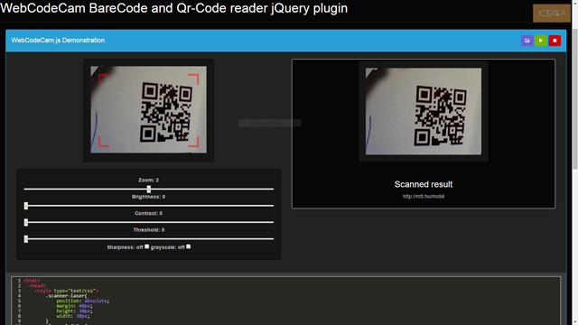

WebCodeCam jQuery-plugin
==========================

version 0.0.1

Barcode scanner plugin for reading qr and barcode with pc-webcamera.

Included some usefull options:

	- Filter options for decoding 
	- Editable result function (return: barcode or qr-code and decoded image data)

Detailed description coming soon!

Demo : http://atandrastoth.co.uk/main/pages/plugins/codereader/

Author: Tóth András 
2014-11-01
